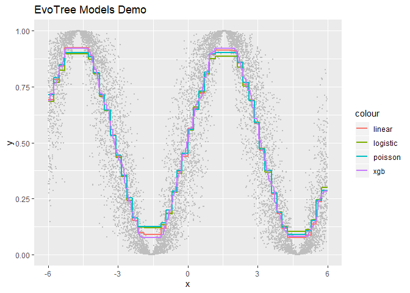

EvoTrees
================

> R package wrapping EvoTrees.jl, a pure Julia tree boosting library.

# Installation

EvoTrees.jl needs first to be installed and available from main Julia
environment. Then, install EvoTree R package with:
`devtools::install_github("Evovest/EvoTrees")`.

# Parameters

  - loss: {“linear”, “logistic”, “Poisson”}
  - nrounds: 10L
  - lambda: 0.0
  - gamma: 0.0
  - eta: 0.1
  - max\_depth: integer, default 5L
  - min\_weight: float \>= 0 default=1.0,
  - rowsample: float \[0,1\] default=1.0
  - colsample: float \[0,1\] default=1.0

# Getting started

``` r
x <- runif(10000, -10, 10)
y <- sin(x) * 0.5 + 0.5
y <- log(y/(1-y)) + rnorm(length(y))
y <- 1 / (1 + exp(-y))
data_train <- matrix(x)
target_train <- y

# linear regression
params <- list(loss = "linear", nrounds = 200, eta = 0.05, lambda = 0.5, gamma = 0.5, max_depth = 5, min_weight = 1, rowsample = 0.5, colsample = 1)
model <- evo_train(data_train = data_train, target_train = target_train, params = params, metric = as.symbol("mse"))
pred_linear <- predict(model = model, data = data_train)

# logistic / cross-engtropy regression
params <- list(loss = "logistic", nrounds = 200, eta = 0.05, lambda = 0.5, gamma = 0.5, max_depth = 5, min_weight = 1, rowsample = 0.5, colsample = 1)
model <- evo_train(data_train = data_train, target_train = target_train, params = params, metric = as.symbol("logloss"))
pred_logistic <- predict(model = model, data = data_train)

# poisson regression
params <- list(loss = "poisson", nrounds = 200, eta = 0.05, lambda = 0.5, gamma = 0.5, max_depth = 5, min_weight = 1, rowsample = 0.5, colsample = 1)
model <- evo_train(data_train = data_train, target_train = target_train, params = params, metric = as.symbol("none"))
pred_poisson <- predict(model = model, data = data_train)

# xgboost reference
params <- list(max_depth = 4, eta = 0.05, subsample = 0.5, colsample_bytree = 1.0, min_child_weight = 1, lambda = 1, alpha = 0, gamma = 1.0, tree_method = "exact", objective = "reg:linear", eval_metric = "rmse")
xgb_train <- xgb.DMatrix(data = data_train, label = target_train)
model <- xgb.train(data = xgb_train, params = params, nrounds = 200, verbose = 1, print_every_n = 10L, early_stopping_rounds = NULL)
pred_xgb <- predict(model, xgb_train)
```

<!-- -->
