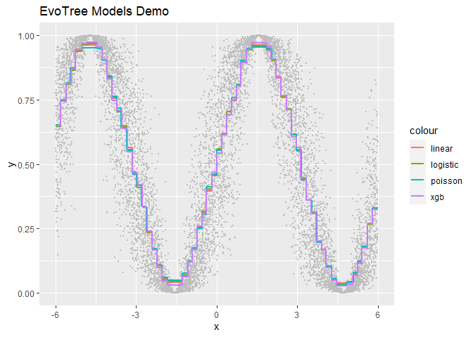
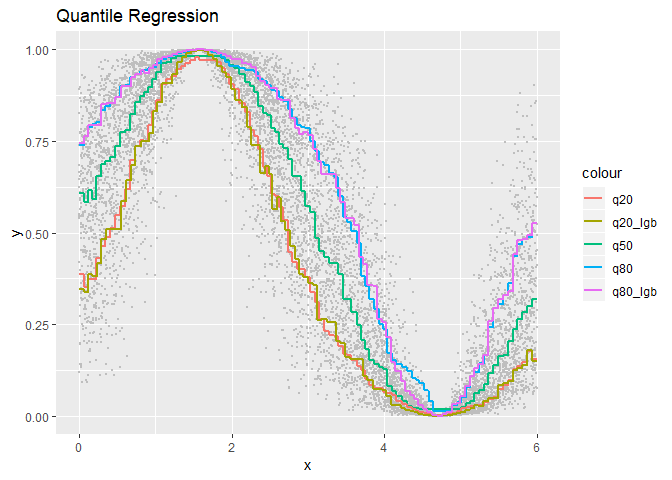

EvoTrees
================

> R package wrapping EvoTrees.jl, a pure Julia tree boosting library.

# Installation

EvoTrees.jl needs first to be installed and available from main Julia
environment. Then, install EvoTree R package with:
`devtools::install_github("Evovest/EvoTrees")`.

# Parameters

  - loss: {“linear”, “logistic”, “poisson”, “quantile”}
  - alpha: float, optional, \[0, 1\], set the quantile and L1 level,
    default=0.5
  - nrounds: 10L
  - lambda: 0.0
  - gamma: 0.0
  - eta: 0.1
  - max\_depth: integer, default 5L
  - min\_weight: float \>= 0 default=1.0,
  - rowsample: float \[0,1\] default=1.0
  - colsample: float \[0,1\] default=1.0
  - nbins: integer \[2,250\] default=250
  - metric: {“mse”, “rmse”, “logloss”, “quantile”}, default=“none”

# Getting started

``` r
# set data
set.seed(123)
x <- runif(10000, -6, 6)
y <- sin(x) * 0.5 + 0.5
y <- log(y/(1-y)) + rnorm(length(y))
y <- 1 / (1 + exp(-y))
data_train <- matrix(x)
target_train <- y

# linear regression
params <- list(loss = "linear", nrounds = 200, eta = 0.05, lambda = 0.5, gamma = 0.5, max_depth = 5, min_weight = 1, rowsample = 0.5, colsample = 1, metric = "mse")
model <- evo_train(data_train = data_train, target_train = target_train, params = params)
pred_linear <- predict(model = model, data = data_train)

# logistic / cross-engtropy regression
params <- list(loss = "logistic", nrounds = 200, eta = 0.05, lambda = 0.5, gamma = 0.5, max_depth = 5, min_weight = 1, rowsample = 0.5, colsample = 1, metric = "logloss")
model <- evo_train(data_train = data_train, target_train = target_train, params = params)
pred_logistic <- predict(model = model, data = data_train)

# poisson regression
params <- list(loss = "poisson", nrounds = 200, eta = 0.05, lambda = 0.5, gamma = 0.5, max_depth = 5, min_weight = 1, rowsample = 0.5, colsample = 1)
model <- evo_train(data_train = data_train, target_train = target_train, params = params)
pred_poisson <- predict(model = model, data = data_train)

# quantile regression - q80
params <- list(loss = "quantile", alpha=0.8, nrounds = 200, eta = 0.05, lambda = 0.0, gamma = 0.0, max_depth = 6, min_weight = 1, rowsample = 0.5, colsample = 1, nbins=100)
model <- evo_train(data_train = data_train, target_train = target_train, params = params)
pred_q80 <- predict(model = model, data = data_train)
table(pred_q80 < target_train) / length(target_train)
```

    ## 
    ##  FALSE   TRUE 
    ## 0.8035 0.1965

``` r
# xgboost reference
params <- list(max_depth = 4, eta = 0.05, subsample = 0.5, colsample_bytree = 1.0, min_child_weight = 1, lambda = 1, alpha = 0, gamma = 1.0, tree_method = "exact", objective = "reg:linear", eval_metric = "rmse")
xgb_train <- xgb.DMatrix(data = data_train, label = target_train)
model <- xgb.train(data = xgb_train, params = params, nrounds = 200, verbose = 1, print_every_n = 10L, early_stopping_rounds = NULL)
pred_xgb <- predict(model, xgb_train)
```

<!-- -->

``` r
# set data
set.seed(123)
x <- runif(10000, 0, 6)
y <- sin(x) * 0.5 + 0.5
y <- log(y/(1-y)) + rnorm(length(y))
y <- 1 / (1 + exp(-y))
data_train <- matrix(x)
target_train <- y

# quantile regression - q50
params <- list(loss = "quantile", alpha=0.5, nrounds = 200, eta = 0.05, nbins=100, lambda = 1.0, gamma = 0.0, max_depth = 4, min_weight = 1, rowsample = 0.5, colsample = 1)
model <- evo_train(data_train = data_train, target_train = target_train, params = params)
pred_q50 <- predict(model = model, data = data_train)

# quantile regression - q20
params <- list(loss = "quantile", alpha=0.2, nrounds = 200, eta = 0.05, nbins=100, lambda = 1.0, gamma = 0.0, max_depth = 4, min_weight = 1, rowsample = 0.5, colsample = 1)
model <- evo_train(data_train = data_train, target_train = target_train, params = params)
pred_q20 <- predict(model = model, data = data_train)

# quantile regression - q80
params <- list(loss = "quantile", alpha=0.8, nrounds = 200, eta = 0.05, nbins=100, lambda = 1.0, gamma = 0.0, max_depth = 4, min_weight = 1, rowsample = 0.5, colsample = 1)
model <- evo_train(data_train = data_train, target_train = target_train, params = params)
pred_q80 <- predict(model = model, data = data_train)

# lightgbm
params <- list(objective = "quantile", alpha=0.2, eta = 0.05, max_bin=100, l1=0, l2=0.5, min_split_gain = 0.0, max_depth = 4, min_weight = 1, rowsample = 0.5, colsample = 1)
dtrain <- lgb.Dataset(data = data_train, label = target_train, free_raw_data = FALSE)
model <- lightgbm::lgb.train(params = params, data = dtrain, nrounds = 100)
pred_q20_lgb <- predict(model, data_train)

params <- list(objective = "quantile", alpha=0.8, eta = 0.05, max_bin=100, l1=0, l2=0.5, min_split_gain = 0.0, max_depth = 4, min_weight = 1, rowsample = 0.5, colsample = 1)
dtrain <- lgb.Dataset(data = data_train, label = target_train, free_raw_data = FALSE)
model <- lightgbm::lgb.train(params = params, data = dtrain, nrounds = 100)
pred_q80_lgb <- predict(model, data_train)

# table(target_train < pred_q50) / length(target_train)
# table(target_train < pred_q20) / length(target_train)
# table(target_train < pred_q80) / length(target_train)
# table(target_train < pred_q20_lgb) / length(target_train)
# table(target_train < pred_q80_lgb) / length(target_train)
```

<!-- -->
